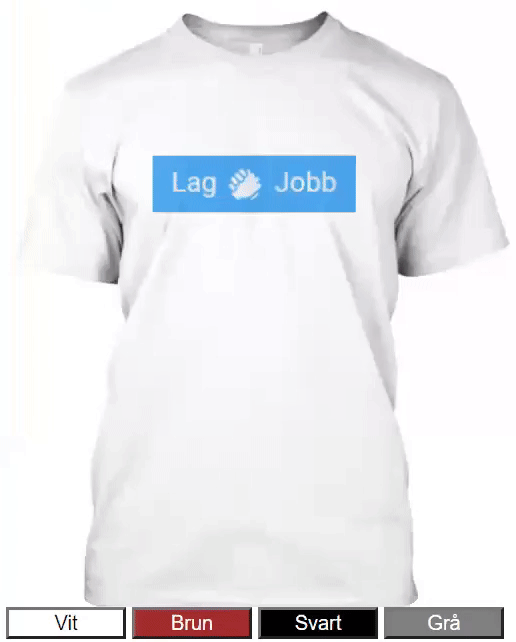

# 200s-javascript-prov
## Regler
* Inte tillåtet att hjälpa varandra på något sätt, räknas som fusk.
* Det är tillåtet att använda internet hur mycket man vill.
* Efter provet kan ni skicka in era svarsfiler som DM till mig via Teams.
Vet ni hur man zippar så får ni zippa mappen med filerna.<br><br>

Börja med att klona eller ladda ner projektet.
<br>
`git clone https://github.com/abbjetmus/200s-javascript-prov.git`
<br>
## Att tänka på

Varje fråga består av en html fil med uppgiftsnumret.<br>
Html filen innehåller en html mall med nödvändiga taggar och en ```script``` tagg där ni ska lägga in er javascript kod.<br>
För att starta programmet dubbel-klickar du bara på html filen i filutforskaren och den öppnas i webbläsaren. Sedan när du gör ändringar i filen laddar du om webbläsaren för att dina ändringar ska synas.
Du får använda valfri editor för att koda men rekommenderar Visual Studio Code.

## Fråga 1 - Variabler
Skapa en variabel som heter <b>radie</b> som tilldelas värdet 5.<br>
Skapa sedan en variabel <b>omkrets</b> som tilldelas omkretsen av en cirkel med hjälp av radie variabeln.<br>
Formeln för omkrets är <i>O = 2&pi;r</i> och värdet på &pi; kan du sätta till 3.14

Skriv ut värdet på omkretsen med <i>alert()</i>.


## Fråga 2 - If-satser
Läs in ett namn med <i>prompt()</i> och lagra det i en variabel som heter <b>name</b>.
Använd if-satser för att kontrollera ifall namnet är <i>Jeton</i> eller <i>Joakim</i>.<br>
Är fallet sådan skriver du ut "Du är en programmeringslärare!".<br>
Är namnet något annat så skriver du ut "Du är inte programmeringslärare!".


## Fråga 3 - For-loopen
 
Skapa en for-loop som loopar igenom talen 1 till 21 och skriver ut talet till konsolen.


## Fråga 4 - For-loop på lista med objekt

Du har en lista nedan med objekt som innehåller information om städer.

```
[{id: 1, name: 'Västerås', county: 'Västmanland'},
{id: 2, name: 'Karlstad', county: 'Värmland'},
{id: 3, name: 'Borlänge', county: 'Dalarna'},
{id: 4, name: 'Malmö', county: 'Skåne'},
{id: 5, name: 'Helsingborg', county: 'Skåne'},
{id: 6, name: 'Kiruna', county: 'Lappland'}]
```
Tilldela listan till en variabel som heter **cities**.
Loopa sedan igenom listan och skriv ut information om varje list-objekt på följande format:
**name - county**, för första objektet skulle det se ut så här **Västerås - Västmanland**.

## Fråga 5
Skapa tre funktioner **add**, **subtract** och **multiply** för matematiska operationer som tar in 3 parametarar **x**, **y** och **z**.
Varje funktion ska addera, subtrahera och multiplicera parametrarna i den ordningen ni själva bestämmer och returnera resultatet.

Anropa sedan varje funktion med valfria värden på parametrarna och skriv ut resultatet till konsolen.


## Fråga 6
Du har en lista nedan med objekt som innehåller information om städer.

```
[{id: 1, name: 'Västerås', county: 'Västmanland'},
{id: 2, name: 'Karlstad', county: 'Värmland'},
{id: 3, name: 'Borlänge', county: 'Dalarna'},
{id: 4, name: 'Malmö', county: 'Skåne'},
{id: 5, name: 'Helsingborg', county: 'Skåne'},
{id: 6, name: 'Kiruna', county: 'Lappland'}]
```
Tilldela listan till en variabel som heter **cities**.

Skapa en funktion som heter findCity(), findCity tar in en parameter på ett Id,
använd Id't för att filtrera ut objektet med det Id't från cities och returnera det.

Använd inbyggda find funktionen för att filtrera: <https://www.w3schools.com/jsref/jsref_find.asp>

Anropa findCity med ett Id som finns i listan och skriv ut namnet på objektet på formatet: 
**name - county**, för första objektet skulle det se ut så här **Västerås - Västmanland**.
Du väljer själv om du vill skriva ut det med <i>alert()</i> eller till konsolen.

## Fråga 7
Du har fått en div-tagg med en t-shirt som bakgrundsbild. Under den finns det 4 knappar **buttons**.<br>
Din uppgift är att byta färg på t-shirten till den färgen som står på knappen när man klickar på den.
Detta görs genom att byta bakgrundsfärg på div-taggen.
1. Skapa en funktion som körs för varje knapp-tryckning.
2. I funktionen hämtar du div-taggen med bilden.
3. Sedan byter du värde på property <i>backgroundColor<i> till nya färgen.

### Resultat

